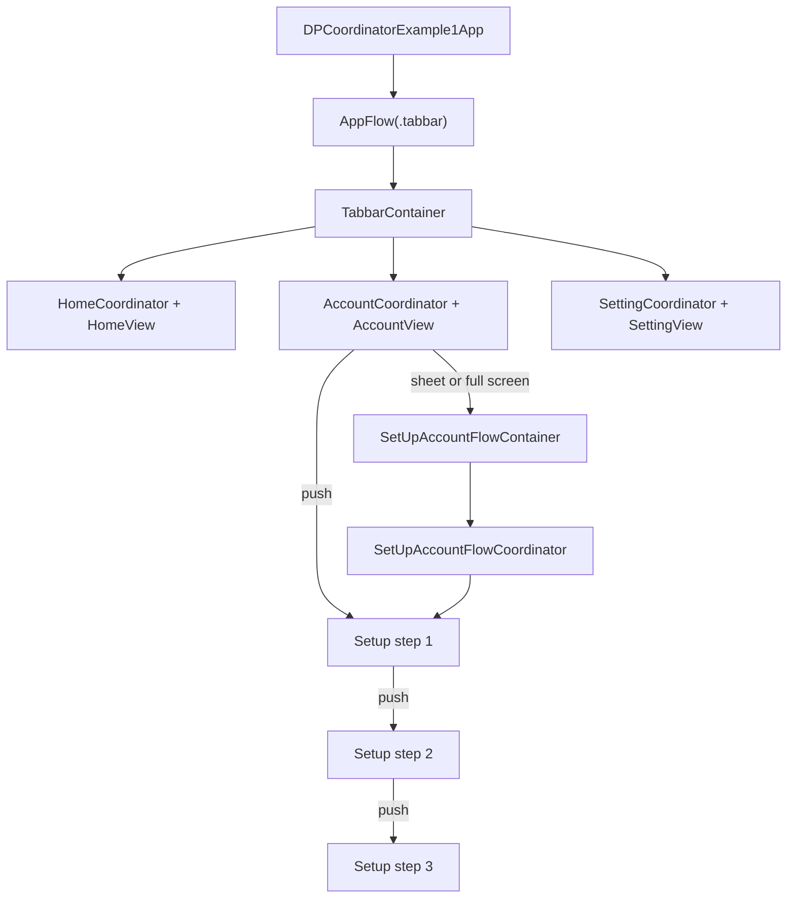

# DPCoordinator

[](https://developer.apple.com/swift)
[]()
[](LICENSE)

`DPCoordinator` is a SwiftUI navigation coordinator. It owns a navigation path, builds destinations from typed screen values, presents screens or entire flows as sheets/full-screen covers, and can pass dismissal requests up to a parent coordinator.

The included example demonstrates three independent tab stacks and a three-step account-setup flow. It is the best reference for how the package is intended to be wired into an app.

## Contents

- [Requirements](#requirements)
- [Install](#install)
- [How the package works](#how-the-package-works)
- [Step-by-step setup](#step-by-step-setup)
- [Navigation and presentation recipes](#navigation-and-presentation-recipes)
- [Example app flow](#example-app-flow)
- [Use cases](#use-cases)
- [Important constraints](#important-constraints)

## Requirements

- iOS 17 or later (as declared in `Package.swift`)
- SwiftUI
- Swift 6.1 toolchain (the package manifest uses Swift tools version 6.1)

## Install

### Swift Package Manager

In Xcode, choose **File → Add Package Dependencies…**, then enter:

```
https://github.com/Datt1994/DPCoordinator.git
```

Add the `DPCoordinator` product to the iOS app target that will use it, then import it where needed:

```swift
import SwiftUI
import DPCoordinator
```

### Manual installation

Copy the Swift files in [`DPCoordinator/DPCoordinator`](DPCoordinator/DPCoordinator) into your app target. Ensure the copied files belong to the target, then omit `import DPCoordinator` because the code is now compiled in the same module.

## How the package works

There are four core pieces:

| Piece | Responsibility |
| --- | --- |
| `Screen` | A typed destination and the SwiftUI view it builds. |
| `Flow` | A typed feature container, normally used for a sheet or full-screen flow with its own coordinator. |
| `BaseCoordinator<Screen, Flow>` | Holds the navigation path and current presentations, and exposes navigation/dismissal methods. |
| `addCoordiantorNavigationStack` | Installs the `NavigationStack`, routes pushed screen IDs to views, handles sheets/full-screen covers, and places the coordinator in the SwiftUI environment. |

The spelling of the public modifier is `addCoordiantorNavigationStack` and the optional dismissal callback is `onDissmiss`. Those names are misspelled in the current public API, so use them exactly as written.

## Step-by-step setup

The following is a compact, standalone pattern you can adapt in another project.

### 1. Define your screen routes and screen builder

Keep route cases free of SwiftUI views. The `Screen` type is the single place that maps a route to its view.

```swift
import SwiftUI
import DPCoordinator

enum AppRoute {
    case home
    case product(id: String)
    case settings
}

struct AppScreen: Screen {
    let id = UUID()
    let route: AppRoute
    var onDissmiss: (() -> Void)?

    init(_ route: AppRoute, onDissmiss: (() -> Void)? = nil) {
        self.route = route
        self.onDissmiss = onDissmiss
    }

    @ViewBuilder
    func build() -> some View {
        switch route {
        case .home:
            HomeView()
        case let .product(id):
            ProductView(productID: id)
        case .settings:
            SettingsView()
        }
    }
}
```

Each `AppScreen` gets a new `UUID`, so the same route can be pushed more than once with different path entries. Do not reuse a screen instance for multiple pushes.

### 2. Define flows for modal feature containers

Use a `Flow` when a modal feature needs its own root view and usually its own navigation stack—for example onboarding, checkout, or account setup.

```swift
enum AppFlowRoute {
    case onboarding
}

struct AppFlow: Flow {
    let id = UUID()
    let route: AppFlowRoute
    var onDissmiss: (() -> Void)?

    init(_ route: AppFlowRoute, onDissmiss: (() -> Void)? = nil) {
        self.route = route
        self.onDissmiss = onDissmiss
    }

    @ViewBuilder
    func build() -> some View {
        switch route {
        case .onboarding:
            OnboardingFlowContainer()
        }
    }
}
```

If a modal only displays one screen and does not need a separate stack, present an `AppScreen` directly instead of creating a flow.

### 3. Create the app coordinator and environment key

`BaseCoordinator` already implements the complete core coordinator behavior. A project-specific subclass gives your views a concrete environment type and is a natural home for app-specific commands later.

```swift
@MainActor
final class AppCoordinator: BaseCoordinator<AppScreen, AppFlow> { }

extension EnvironmentValues {
    @Entry var appCoordinator: AppCoordinator? = nil
}
```

### 4. Install one coordinator at the root of each navigation stack

The modifier creates the `NavigationStack` and injects the coordinator into the environment. A root container is the right place to retain it with `@StateObject`.

```swift
struct AppRootView: View {
    @StateObject private var coordinator = AppCoordinator()

    var body: some View {
        HomeView()
            .addCoordiantorNavigationStack(
                using: coordinator,
                environmentKeyPath: \.appCoordinator
            )
    }
}

@main
struct MyApp: App {
    var body: some Scene {
        WindowGroup {
            AppRootView()
        }
    }
}
```

### 5. Navigate from a screen

Read the injected coordinator in any descendant view and call its methods. Views describe user interaction; the coordinator owns navigation state.

```swift
struct HomeView: View {
    @Environment(\.appCoordinator) private var coordinator

    var body: some View {
        VStack {
            Button("Open product") {
                coordinator?.push(AppScreen(.product(id: "42")))
            }

            Button("Settings") {
                coordinator?.present(sheet: AppScreen(.settings))
            }

            Button("Start onboarding") {
                coordinator?.present(full: AppFlow(.onboarding))
            }
        }
    }
}
```

### 6. Give a modal flow its own coordinator

A flow container is responsible for its own `@StateObject`. Pass the presenting coordinator as its parent; this lets `dismiss()` fall back to the coordinator that presented the flow when the child has nothing local to dismiss.

```swift
extension EnvironmentValues {
    @Entry var onboardingCoordinator: OnboardingCoordinator? = nil
}

@MainActor
final class OnboardingCoordinator: BaseCoordinator<AppScreen, AppFlow> { }

struct OnboardingFlowContainer: View {
    @StateObject private var coordinator = OnboardingCoordinator()
    @Environment(\.appCoordinator) private var parentCoordinator

    var body: some View {
        WelcomeView()
            .addCoordiantorNavigationStack(
                using: coordinator,
                environmentKeyPath: \.onboardingCoordinator,
                parentCoordinator: parentCoordinator
            )
    }
}
```

The `WelcomeView` can now use `@Environment(\.onboardingCoordinator)` to push onboarding screens. Calling `dismiss()` from this child coordinator dismisses its sheet/full-screen flow through the parent coordinator when appropriate.

## Navigation and presentation recipes

| Goal | Call | Result |
| --- | --- | --- |
| Push a screen | `push(AppScreen(.product(id: "42")))` | Adds a destination to the current stack. |
| Go back one screen | `pop()` | Removes the last pushed screen; returns `false` at root. |
| Go back several screens | `pop(2)` | Removes that many path entries; returns `false` if there are too few. |
| Return to the stack root | `popToRoot()` | Clears the current navigation path. |
| Present one screen as a sheet | `present(sheet: AppScreen(.settings))` | Shows the screen with SwiftUI `sheet`. |
| Present a flow as a sheet | `present(sheet: AppFlow(.onboarding))` | Shows the flow’s root container in a sheet. |
| Present one screen full screen | `present(full: AppScreen(.settings))` | Shows the screen with `fullScreenCover`. |
| Present a flow full screen | `present(full: AppFlow(.onboarding))` | Shows the flow’s root container full screen. |
| Show a system alert | `showAlert(AlertConfig(...))` | Shows a SwiftUI alert from the current coordinator. |
| Dismiss a sheet | `dismissSheetScreen()` | Dismisses the local sheet/flow, otherwise asks the parent. |
| Dismiss a full-screen cover | `dismissFullScreen()` | Dismisses the local full-screen cover/flow, otherwise asks the parent. |
| Dismiss whatever is active | `dismiss()` | Dismisses local presentations, otherwise asks the parent. |

`pop`, `popToRoot`, and the dismissal methods return `Bool`. Use that return value when a failed action matters, such as disabling a custom back button at the root.

### Show a system alert

The navigation-stack modifier automatically attaches the alert presenter. Create an `AlertConfig` with one or two buttons, then pass it to `showAlert` from a view that has access to the coordinator.

```swift
Button("Delete account") {
    coordinator?.showAlert(
        AlertConfig(
            title: "Delete account?",
            message: "This action cannot be undone.",
            primaryButton: AlertConfigButton(label: "Delete") {
                // Perform the destructive action.
            },
            secondaryButton: AlertConfigButton(label: "Cancel")
        )
    )
}
```

Call `coordinator?.dismissAlert()` when you need to close an active alert in code. Tapping either configured SwiftUI button runs its action; SwiftUI also dismisses the alert.

### Cleanup callback

Both `Screen` and `Flow` have an optional `onDissmiss` closure. Attach it when constructing the route when you need cleanup associated with that route:

```swift
coordinator?.push(
    AppScreen(.product(id: "42"), onDissmiss: {
        // Stop work or release feature-specific state.
    })
)
```

For pushed screens, `BaseCoordinator` invokes this when an ID disappears from its navigation path. Treat the callback as a cleanup hook, not as the primary place for essential persistence or business logic.

## Example app flow

The included app separates navigation state per tab and starts a child account-setup coordinator when the setup flow is presented modally.



| Example file | What it demonstrates |
| --- | --- |
| [`TabbarContainer.swift`](DPCoordinator/DPCoordinatorExample1/TabbarContainer.swift) | A separate `@StateObject` coordinator and navigation stack for each tab. |
| [`AppScreen.swift`](DPCoordinator/DPCoordinatorExample1/Coordinators/ScreenBuilders/AppScreen.swift) | One screen wrapper dispatching to main and account screen builders. |
| [`AppFlow.swift`](DPCoordinator/DPCoordinatorExample1/Coordinators/FlowBuilder/AppFlow.swift) | A root tab flow and a modal account-setup flow. |
| [`AccountView.swift`](DPCoordinator/DPCoordinatorExample1/Modules/AccountModule/AccountView.swift) | Push, modal-flow sheet, and modal-flow full-screen entry points. |
| [`SetUpAccountFlowCoordinator.swift`](DPCoordinator/DPCoordinatorExample1/Coordinators/SetUpAccountFlowCoordinator.swift) | A child flow’s coordinator, environment key, and parent relationship. |
| [`SetUpAccountStepThreeView.swift`](DPCoordinator/DPCoordinatorExample1/Modules/AccountModule/SetUpAccountStepThreeView.swift) | `pop`, `popToRoot`, multi-pop, and `dismiss`. |

The example also defines `AppCoordinator`, `AppBaseCoordinator`, loading UI, and a custom popup alert under `DPCoordinatorExample1/Coordinators`. Those are example-app extensions, not public features supplied by the `DPCoordinator` package. Copy or adapt them only if your app needs them.

## Use cases

- Independent navigation histories per tab: create one coordinator and one `addCoordiantorNavigationStack` per tab, as the example does.
- Multi-step forms or wizards: model each step as a `Screen`; use `push`, `pop`, and `popToRoot` for linear progress and reset.
- Onboarding, authentication, checkout, or account setup: model the feature as a `Flow`, present it modally, and install a child coordinator inside its container.
- Detail and drill-down navigation: carry the required identifier or value in the route enum, such as `case product(id: String)`.
- Feature-scoped cleanup: supply `onDissmiss` for navigation-path cleanup after a pushed screen is removed.
- Cross-tab navigation: keep tab selection in a small separate `ObservableObject` (like `TabCoordinator` in the example); let individual tab coordinators continue to own their own stacks.
- App-specific overlays: subclass `BaseCoordinator` in the app and add published overlay state, then apply an app-owned view modifier around the package navigation modifier.

## Important constraints

- Do not put a second `NavigationStack` inside a view that is already wrapped with `addCoordiantorNavigationStack`. A presented `Flow` is the intended boundary for a new stack.
- Use `@StateObject` only at a coordinator’s owner (root container, tab container, or flow container). Descendant views should obtain it with `@Environment`.
- Do not mutate `navigationPath` directly. Use `push`, `pop`, or `popToRoot` so the package can retain and clean up the matching screen builders.
- `Screen.id` and `Flow.id` must be stable for the lifetime of their individual value and distinct for separately presented/pushed instances. A stored `UUID()` meets this requirement.
- The package has no test target at present. Validate your route builders and presentation behavior in an app target when adding new flows.

## License

See [LICENSE](LICENSE).
